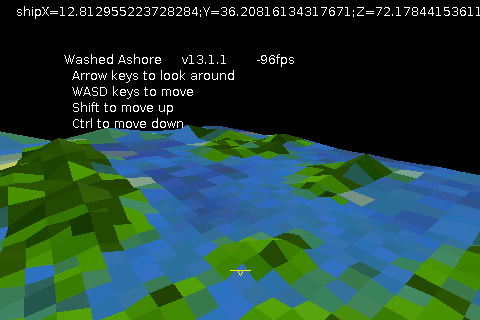
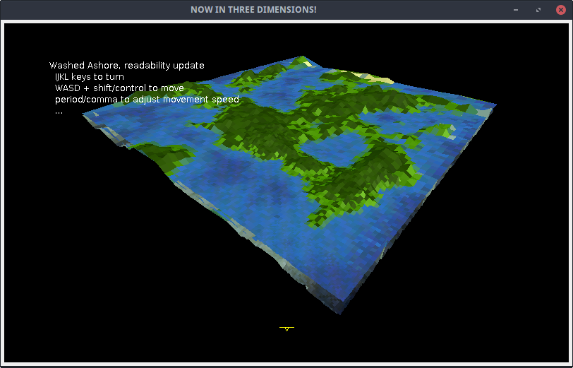

# washed-ashore
Cleanup of a several-year-old 3D project written in java.

I wrote this code late in my junior year of High School (spring 2013), after taking AP computer science the previous year, but moving OS's several times has messed up date-created metadata. [This video](https://youtu.be/Dwpgf_NmQjc) from February 2013 shows an early version of the code that would grow into this program.



The program is interesting, but the code is a mess. It only uses 2D draw calls, performing all the projection math from 3D. All of the geometry generation and rendering code is in one file, which also reads the player's keyboard and moves their ship/camera. It isn't exactly easily readable or easy to modify.

I'm currently just cleaning up the formatting and removing dead/commented-out code, but there's plenty of areas where a section of code is repeated almost exactly, with minor changes in values. This is especially true of the geometry generation sections, where a series of nested loops trace different kinds of pseudo-cylinders.



This is a screenshot with the level of detail turned way up, showing the resolution of the generated island. In this configuration, the framerate is abysmal, especially on a laptop. All the math projecting where a vertex ought to be drawn is recalculated each frame on the CPU with not a thought given towards optimization, so this isn't surprising.

The existing draw code could be reworked and optimized; Using OpenGL for the projection and rendering would be a huge performance boost, and would remove the need for the depth-sorting hacks I came up with.

## Building and running it
You can build and run the code by cloning the code and running `./build_and_run` script, or typing the following from a terminal:
```
$ javac *.java
$ java GameViewer3d
```
Javac will complaing about ~100 errors, but you can ignore them since they're coming from the `ShipGen.java` class, which is disabled.

## Controls
Press the `Escape` key to unpause the program, and the rest of the controls are onscreen.

- `IJKL` adjust the camera, with Y-axis is inverted like a flight sim.
- `WASD` to move laterally plus `shift` and `control` to move vertically.
- `comma` and `period` adjust the movement speed, halving and doubling it respectively.

for some reason the default movement speed is really low so you probably want to hit `.` a couple times
